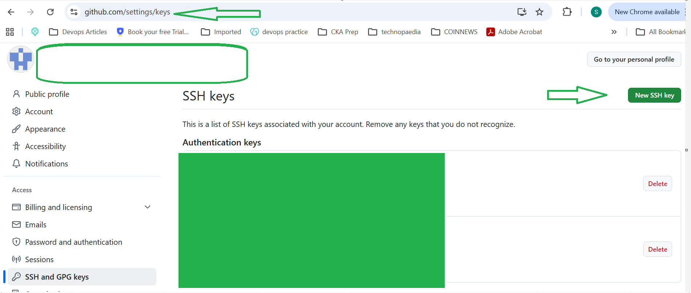

# full-stack-app

# Welcome to your first Project on Github.
# If you are reading this message it means you are part of a project and you have started collaborating on github.
# The assignment below is important to ensure you understand the basics and the big picture of collaborating with other developers.

#############################################################
#############################################################

# Assignment 

#############################################################
#############################################################

# 1. Clone this repository to your local using the command git clone git@github.com:Technopaedia/full-stack-app.git

# For this to be successful you need to set up an SSH Key on your Github Account, you can use the following commands/instructions to set it up

#   ssh-keygen -t rsa -b 4096 -C "The email address of your github account"
#   cat ~/.ssh/id_rsa.pub
#   copy the output and paste it in your gihub account[]

#   eval "$(ssh-agent -s)"
#   ssh-add -l
#   ssh-add ~/.ssh/id_rsa
#   ssh -T git@github.com
#   After the initial set up, you can run the git clone command in your local and you will have a copy of the repository in your local.

# 2. Create a feature branch from the main branch and name it after yourself in this format.------> feature/todaysdate/yourname

# if you did this correctly the name of the branch would look like this ----> feature/28-01-2026/zolt

# Add any script of your choice to the project and name it #after your self. This should be a script that you are most familiar with and that you can explain to anybody. Any script of your choice is fine. Name the script <yourname.sh> e.g rebecca.sh. Dont forget to tell us how to use the script(You can put this in comments).

# 3. a) stage your changes by using the command (git add .)

#    b) commit your changes by using the command (git coomit #-m "Added my script")

#    c) PUSH YOUR CHANGES TO THE YOUR BRANCH IN THE REMOTE #REPOSITIRY (IT DOESNT EXIST YET ON THE REMOTE REPOSITORY, SO YOU NEED TO FIND THE COMMAND THAT WILL MAKE IT EXIST WHEN YOU PUSH YOUR CHANGES)

# 4. Create a Pull request so that your changes can be added to the main branch(Do this when your changes reflect on the remote repository)

# Doing my part 
